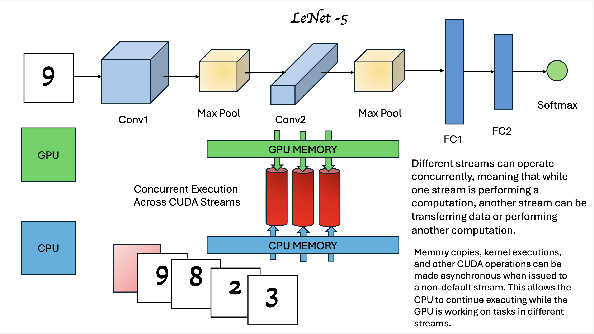

## Compile Instructions

```bash
module load compiler/cuda/9.2/compilervars
```

```bash
make
```
## Subtask 1

./subtask1 [task of choice 1=convolution, 2=non-linear-activations, 3=subsampling, 4=converting a vector]

1. With convolution, You'll be given N, M, and P. A square matrix of size N and a kernel of size M along with padding value P will be given. All the values will be space seperated and look something like

```bash
./subtask1 1 15 5 0 13 73 72 68 82 0 0 0 237 .... 45  4 6 4 8 4 4 5
```
2. You'll be given an activation function (0=relu 1=tanh), N and M of the matrix size and matrix itself.

```bash
./subtask1 2 0 15 5 13 73 72 68 82 0 0 0 237 .... 45  4 6 4 8 4 4 5
```
3. You will be given pooling function (0=max pool, 1=avg pool), size of matrix N, and the matrix. 

4. You will be given the function (0=sigmoid or 1=softmax), and a vector of numbers.

Ouput is printed on terminal

## Subtask 2

With subtask 2, you can follow the same execution format.

```bash
./subtask2 [task of choice 1=convolution, 2=non-linear-activations, 3=subsampling, 4=converting a vector]
```
Ouput is printed on terminal

## Subtask 3

With subtask 3, we assume the files are preprocessed using the preprocess.py function . We have written a statement in the make file for its execution. So we will be running a simple

```bash
./subtask3 
```

The images should be in img folder , Output will be in output folder

##Subtask 4
With subtask 4, the execution will be 

```bash
./subtask4 [1 - with streams, 0 - without streams]
```

The images should be in img folder , Output will be in output folder

## Subtask 1 and Subtask2


## Subtask 3


## Subtask 4



